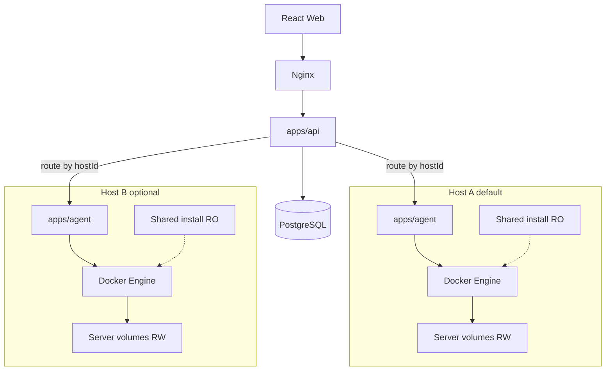

# Bannerlord Coop Server Panel — Architecture

Linux-native game server orchestration inspired by AMP and Pterodactyl. Bannerlord Coop is the first game adapter; the control plane is game-agnostic.

**Platform:** Linux only. Windows is not a supported deployment target. Each Coop instance runs in a Docker container under Wine.

## Decisions

| Decision | Choice |
|----------|--------|
| Default topology | One API + one Management Agent on one host; N Coop containers |
| Multi-host | First-class `hosts` registry; each server has a `hostId`; API routes by host |
| Control plane | `apps/api` (auth, DB, REST, Socket.IO to browsers) + `apps/agent` (Docker, mounts, console) |
| Game assets | Outside the repo under per-host `dataRoot` (default `/var/lib/bannerlord-panel/`) |
| Package swap | Drop in new `DedicatedServer/` / `CoopData/`, run import — no code changes |
| Game ports | Auto-allocate from **4200** upward per host; written into config + Docker publish |
| Steam | Always `false` for panel-managed servers |
| UI config | Launcher-like settings layout; slate/teal palette (not brown/gold) |

## Runtime topology



- **Default:** only Host A — one agent manages every Coop container on that machine.
- **Scale:** register another host; run another agent; assign new servers to that `hostId`.
- Never run one Node.js process per Coop instance.

### Host / node registry

Conceptual PostgreSQL:

- `hosts`: `id`, `name`, `endpoint`, `agent_token_hash`, `data_root`, `status`, `capabilities`, `created_at`
- `servers`: required `host_id`, `installation_id`, `game_port`, …

Agent bootstrap:

1. Start with `AGENT_TOKEN`, `API_URL`, optional `HOST_ID`.
2. Persistent WebSocket to API; heartbeats mark host online.
3. API keeps `hostId → agentSocket` for command routing and console fan-in.

## Coop dedicated server constraints

Derived from the official Windows x64 package (`release-info.txt`, layered-v1 layout):

| Concern | Fact |
|---------|------|
| Entry | `BannerlordCoopServer.exe` via Wine |
| Data | `--data-dir` → `server-config.json`, `Game Saves/`, `logs/` |
| Gameplay | Parent `mod-config.json` |
| Client port | UDP (default **4200**) |
| Engine | Dedicated custom server arg (e.g. **7210**) |
| Modules | Native → SandBoxCore → SandBox → Coop → DedicatedServer.Windows (default); overridable per instance via Modules tab |
| Integrity | Coop DLLs SHA-256 pinned; mismatch → exit code **4** |
| Console | `help`, `status`, `players`, `save`, `say`, `kick`, `stop` + `@DS@` events |

Shared RO install mirrors `engine/` (bin, Modules, Parameters, dotnet). Per-server RW holds the CoopData-shaped tree. Extra global mods must not break Coop pin verification.

## Shared installs and mounts

```text
/var/lib/bannerlord-panel/
  installations/
    <version-id>/          # immutable shared root (imported)
      BannerlordCoopServer.exe
      engine/
      release-info.txt
      archive-layout.json
  mods/                    # shared third-party Modules (install once)
  modpacks/                # named load-order presets (JSON)
  servers/
    <server-id>/
      wineprefix/
      data/                # --data-dir
        server-config.json
        Game Saves/
        logs/
      mod-config.json
      modules.json         # per-instance enabledOrderedIds
      modules.arg          # `_MODULES_*…*_MODULES_` for entrypoint
      server-mods/
      tmp/
  backups/
  templates/
```

Container mounts:

- **RW:** installation → `/opt/bannerlord` (Coop AutoSync writes `AutoSyncExport` under the Coop module; cannot be `:ro`)
- **RO:** selected global mods from `{dataRoot}/mods/<Module>/` → `/opt/bannerlord/engine/Modules/<Module>`
- **RW:** `servers/<id>/` → `/srv/instance` (`--data-dir /srv/instance/data`)
- **RW:** wineprefix, tmp

Per-instance module enablement + load order is stored in `servers/<id>/modules.json` (and `modules.arg` for the entrypoint). On start, the runtime passes Bannerlord’s `_MODULES_*…*_MODULES_` argument. Clients must use the same module set.

Workspace `DedicatedServer/` and `CoopData/` are **staging inputs only** (gitignored). Containers never mount the workspace copies. See [replacing-installations.md](./replacing-installations.md).

## Port allocation

Per host (ports are host-local):

| Rule | Behavior |
|------|----------|
| Base | `gamePortBase` default **4200** |
| Assign | Lowest free integer ≥ base among panel servers on that host |
| Persist | `servers.game_port` + `server-config.json` + Docker publish |
| Delete | Port returns to the free pool |
| Steam | Not used; `steam` always written `false` |

Auxiliary ports (engine base **7210**, etc.) follow the same per-instance increment when exposed.

## Game-agnostic adapter

```ts
interface IGameServerAdapter {
  create(spec: CreateServerSpec): Promise<void>;
  start(id: string): Promise<void>;
  stop(id: string): Promise<void>;
  restart(id: string): Promise<void>;
  kill(id: string): Promise<void>;
  sendConsoleCommand(id: string, cmd: string): Promise<void>;
  getStatus(id: string): Promise<ServerStatus>;
  getPlayers(id: string): Promise<PlayerInfo[]>;
  getMetrics(id: string): Promise<ResourceMetrics>;
  backup(id: string): Promise<BackupRef>;
  restore(id: string, backup: BackupRef): Promise<void>;
}
```

First implementation: `BannerlordCoopAdapter` in the agent. Types live in `@bannerlord-panel/shared`.

## Service responsibilities

| Service | Owns | Does not own |
|---------|------|----------------|
| **web** | UI, auth to API | Docker, host filesystem |
| **api** | Users/RBAC, host registry, server records, templates, settings, Socket.IO to browsers, route-by-`hostId` | Direct Docker |
| **agent** | Containers on this host, port allocation, mounts, console, path-jailed file manager, stats, local backups, config files | Other hosts, user password store |

Frontend never talks to Docker.

## WebSocket model

- Browser ↔ API: rooms `server:<id>`
- API ↔ Agent: one authenticated connection per host
- Events: `agent:console`, `agent:stats`, `agent:task-progress`, `agent:heartbeat`
- Console: Wine stdout → agent → API → browser (no log polling)

## UI design

### Shell

AMP-inspired dark panel: sidebar navigation, server cards (name, status, CPU/RAM, players, save, uptime, port, version), responsive layout.

### Per-server Settings

Matches the official Coop Server Launcher **information architecture** (Dedicated Server / Campaign Difficulty / Coop Gameplay, Reload from disk, Save settings), restyled:

| Token | Value |
|-------|--------|
| `--bg` | `#0b1220` |
| `--surface` | `#121a2b` |
| `--surface-2` | `#182338` |
| `--border` | `#2a3a55` |
| `--text` | `#e8eef8` |
| `--muted` | `#9aa8c0` |
| `--accent` | `#3db8a8` |
| `--accent-hover` | `#4ecfc0` |
| `--danger` | `#e85d5d` |
| `--success` | `#3ecf8e` |

Typography: DM Sans or IBM Plex Sans (not Inter/Roboto/Arial).

| Section | Editable | Locked |
|---------|----------|--------|
| Process (`server-config`) | saveName, autosaveMinutes, password, logFile | **Port** (read-only); **steam** omitted / always `false` |
| Difficulty | dropdowns / omit for save default | — |
| Coop `modOptions` | as in `mod-config.default.json` | — |

API rejects or ignores client attempts to change `port` or set `steam: true`.

## Security baseline

- JWT access + refresh; roles Admin / Moderator / Viewer
- Per-host agent token; agent not publicly exposed
- File manager scoped to that server’s data directory
- Secrets in DB/env, never in shared installs
- Nginx TLS for web/API in production

### RBAC (Phase 4)

| Role | Permissions |
|------|-------------|
| admin | All (`users:manage`, installations write, server create/delete, control, settings) |
| moderator | Read + `servers:control` + console read/write |
| viewer | Read-only (servers, hosts, installations, settings, console) |

## Monorepo layout

```text
apps/web          # React Vite Tailwind shadcn
apps/api          # Express TypeScript
apps/agent        # Host management agent
packages/shared   # Shared types and contracts
docker/           # Runtime image, compose, templates
database/         # Migrations
scripts/          # import-installation, etc.
staging/          # Optional drop zone for new packages
docs/             # This document and roadmap
```

## Phase 3 Docker management (summary)

- Runtime image: `bannerlord-panel/runtime:latest` (Wine + entrypoint; no game files)
- Agent creates containers with RO install bind + RW `servers/<id>` + wineprefix
- API allocates `game_port` / `engine_port` (from 4200 / 7210 upward) and routes lifecycle commands to the owning agent
- `DELETE /api/servers/:id` removes the container only; instance data and backups remain on disk

## Phase 6 Console (summary)

```text
Container logs/stdin → Agent ConsoleStreamer → agent:console
  → API BrowserGateway → room server:<id> → React console
```

Browser connects to `/client-socket` with JWT; subscribe/unsubscribe ref-counts agent log followers. Commands require `console:write`.

## Phase 7 File manager (summary)

```text
Browser → REST /api/servers/:id/files/* → AgentGateway → fs.* → ServerFileManager
  → {dataRoot}/servers/<id>/data/  (reject path escape; hides wineprefix + mod-config)
```

Upload/download use base64 over JSON (45mb body limit) or binary download. Zip via `adm-zip`. Mutations require `servers:write`.

## Phase 8 Scheduler (summary)

```text
API ScheduleRunner (15s) → due scheduled_tasks
  → countdown: inject console + emit restart.countdown to room
  → action: gateway server.start|stop|restart | console inject
```

Schedules live in Postgres (`scheduled_tasks`). Cron expressions are UTC.

## Phase 9 Backup system (summary)

```text
API → agent server.backup → zip to {dataRoot}/backups/<serverId>/<id>.zip
  includes: data/server-config.json, data/Game Saves/, mod-config.json, modules.json, modules.arg, server-mods/
  excludes: wineprefix/, tmp/, data/logs/
Restore: stop if running → extract → optional start
Retention: settings.backups.retentionCount (default 10)
```
